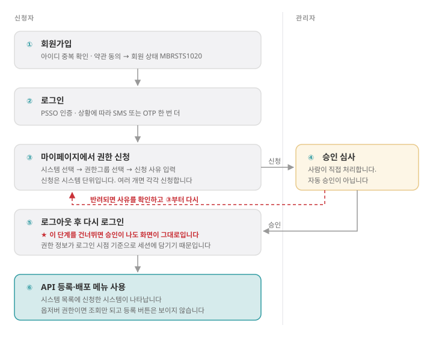

# 가입 절차 한눈에 보기

가입만 하면 끝이 아닙니다. **회원가입 → 권한 신청 → 관리자 승인 → 재로그인**까지 마쳐야
API 등록·배포 메뉴가 열립니다. 각 단계의 상세는 [[로그인과-회원가입]] 과
[[마이페이지-권한신청]] 에 있고, 이 문서는 순서와 걸리는 지점만 모았습니다.

## 전체 흐름

승인은 **사람이 직접 처리합니다.** 자동 승인이 아니라서 신청 즉시 열리지 않습니다.
그리고 승인이 난 뒤에는 **반드시 다시 로그인해야 합니다** — 이 두 가지가 문의의
대부분입니다.

## 단계별로 하는 일

| # | 단계 | 어디서 | 끝났는지 확인하는 법 |
|---|---|---|---|
| ① | 회원가입 | `/apidev/userJoin/userJoinForm.do` | 회원 상태가 `MBRSTS1020` |
| ② | 로그인 | `/apidev/login/loginForm.do` | 상단에 이름이 보임 |
| ③ | 권한 신청 | 마이페이지 | 권한 현황에 '신청' 상태로 뜸 |
| ④ | 관리자 승인 | — | 권한 현황이 '승인'으로 바뀜 |
| ⑤ | 다시 로그인 | 로그아웃 후 재로그인 | 좌측 메뉴에 등록·배포가 나타남 |
| ⑥ | API 등록 | API Manager | 시스템 목록에 신청한 시스템이 보임 |

③은 **시스템 단위**로 신청합니다. 여러 시스템이 필요하면 각각 신청해야 합니다.

## 왜 승인 뒤에 다시 로그인해야 하나

권한 정보가 **로그인하는 순간의 값으로 세션에 담기기** 때문입니다. 승인은 서버 데이터만
바꾸므로, 이미 열려 있는 세션은 예전 권한을 그대로 들고 있습니다. 로그아웃했다가 다시
로그인하면 그 시점의 권한으로 세션이 새로 만들어집니다.

새로고침만으로는 바뀌지 않습니다. 세션 자체를 다시 만들어야 합니다.

## 자주 묻는 질문

**Q. 가입했는데 메뉴가 거의 안 보입니다.**
A. 정상입니다. 가입은 ①까지만 끝난 상태이고, ③ 권한 신청과 ④ 승인이 남았습니다.

**Q. 승인이 났다고 메일을 받았는데 화면이 그대로입니다.**
A. ⑤를 건너뛴 경우입니다. 로그아웃 후 다시 로그인하세요.

**Q. 승인이 언제 나나요?**
A. 관리자가 수동으로 처리합니다. 급하면 신청 사유에 담당자와 연락처를 적어 두면
확인이 빨라집니다.

**Q. 로그인은 되는데 등록 버튼이 없습니다.**
A. 옵저버(조회 전용) 권한일 수 있습니다. 등록이 필요하면 작성자 권한을 신청하세요.

**Q. 신청이 반려되면 어떻게 하나요?**
A. 반려 사유를 확인하고 ③부터 다시 신청합니다. 대부분 신청 사유가 비어 있거나
시스템을 잘못 고른 경우입니다.
